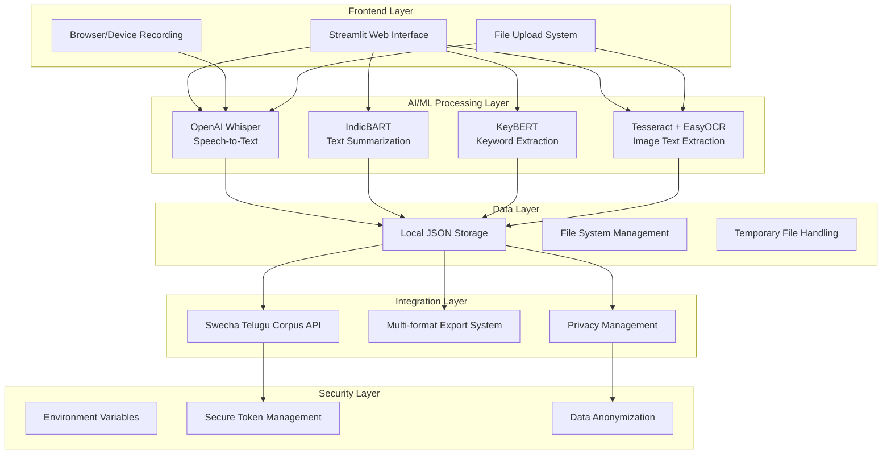

# 🛠️ WhispNote - Complete Tech Stack Documentation

## 📋 Project Overview

**WhispNote** is an advanced AI-powered multilingual voice note application designed specifically for Indian languages. Built with a privacy-first approach, it combines cutting-edge AI/ML technologies with secure, offline-first architecture to provide seamless speech-to-text, summarization, and text analysis capabilities.

**Version**: 2.0.0
**License**: AGPL-3.0
**Platform**: Cross-platform (Windows, macOS, Linux)
**Architecture**: Modular, microservices-inspired design

---

## 🏗️ System Architecture



---

## 🧩 Core Technologies

### 🎨 **Frontend & User Interface**

#### **Streamlit** `v1.28.0+`
- **Purpose**: Modern web-based UI framework for Python applications
- **Key Features**:
  - Real-time reactive interface
  - Built-in file upload components
  - Interactive widgets and forms
  - Automatic rerun on code changes
  - Session state management
- **Why Chosen**: Rapid prototyping, Python-native, minimal HTML/CSS/JS required
- **Components Used**:
  - `st.tabs()` for organized workflow
  - `st.file_uploader()` for audio/image uploads
  - `st.columns()` for responsive layouts
  - `st.sidebar` for settings and configuration
  - `st.components.v1.html()` for custom browser recording

#### **HTML5 Audio API**
- **Purpose**: Browser-based audio recording functionality
- **Features**:
  - `MediaRecorder API` for real-time recording
  - `getUserMedia()` for microphone access
  - Audio playback with HTML5 `<audio>` elements
  - Cross-browser compatibility (Chrome, Firefox, Safari, Edge)

---

### 🤖 **AI/ML Technologies**

#### **Speech Recognition**

##### **OpenAI Whisper** `v20231117+`
```python
# Model variants and use cases
WHISPER_MODELS = {
    "tiny": {
        "size": "39 MB",
        "speed": "~32x realtime",
        "accuracy": "Good for testing",
        "vram": "~1 GB"
    },
    "base": {
        "size": "74 MB",
        "speed": "~16x realtime",
        "accuracy": "Balanced option",
        "vram": "~1 GB"
    },
    "small": {
        "size": "244 MB",
        "speed": "~6x realtime",
        "accuracy": "High accuracy",
        "vram": "~2 GB"
    },
    "medium": {
        "size": "769 MB",
        "speed": "~2x realtime",
        "accuracy": "Very high accuracy",
        "vram": "~5 GB"
    },
    "large": {
        "size": "1550 MB",
        "speed": "1x realtime",
        "accuracy": "Best accuracy",
        "vram": "~10 GB"
    }
}
```

- **Supported Languages**: 99+ languages including:
  - **Indian Languages**: Hindi, Telugu, Tamil, Bengali, Marathi, Gujarati, Kannada, Malayalam, Punjabi
  - **International**: English, Spanish, French, German, Chinese, Japanese, Arabic, etc.
- **Key Features**:
  - Zero-shot multilingual recognition
  - Automatic language detection
  - Robust to accents and dialects
  - Offline processing after model download
  - Built-in VAD (Voice Activity Detection)

#### **Text Summarization**

##### **IndicBART** (AI4Bharat)
```python
# Model configuration
MODEL_CONFIG = {
    "model_name": "ai4bharat/IndicBART",
    "tokenizer": "ai4bharat/IndicBART",
    "supported_languages": [
        "hi", "bn", "gu", "mr", "ta", "te", "kn", "ml", "pa", "en"
    ],
    "max_input_length": 1024,
    "max_output_length": 256,
    "beam_search": True,
    "num_beams": 4
}
```

- **Architecture**: BART (Bidirectional and Auto-Regressive Transformers)
- **Training**: Pre-trained on large Indian language corpora
- **Capabilities**:
  - Abstractive summarization
  - Cross-lingual understanding
  - Context-aware text generation
  - Handles code-switching (multiple languages in same text)

##### **Transformers Library** `v4.21.0+`
- **Framework**: Hugging Face Transformers
- **Pipeline**: Text-to-text generation pipeline
- **Optimization**: Model caching and GPU acceleration support
- **Memory Management**: Automatic cleanup and batch processing

#### **Keyword Extraction**

##### **KeyBERT** `v0.7.0+`
```python
# KeyBERT configuration
KEYBERT_CONFIG = {
    "model": "all-MiniLM-L6-v2",  # Sentence transformer model
    "top_k": 10,                  # Number of keywords to extract
    "keyphrase_ngram_range": (1, 2),  # Unigrams and bigrams
    "stop_words": "english",      # Stop word filtering
    "highlight": True,            # Highlight important terms
    "diversity": 0.5              # Diversity in keyword selection
}
```

- **Method**: BERT embeddings + cosine similarity
- **Multilingual Support**: Via sentence-transformers
- **Features**:
  - N-gram keyword extraction
  - Semantic similarity scoring
  - Diversity optimization
  - Custom stop word lists
  - Phrase highlighting

##### **Sentence Transformers** `v2.2.0+`
- **Purpose**: Semantic text embeddings for keyword extraction
- **Models Used**: `all-MiniLM-L6-v2` for efficiency
- **Capabilities**: Cross-lingual sentence embeddings

#### **Optical Character Recognition (OCR)**

##### **Primary: Tesseract OCR** `v5.0+` via `pytesseract`
```python
# Tesseract configuration
TESSERACT_CONFIG = {
    "languages": ["eng", "hin", "ben", "tel", "tam", "guj", "kan", "mal", "mar", "pan"],
    "psm": "6",  # Uniform block of text
    "oem": "3",  # Default OCR Engine Mode
    "config": "--psm 6 -c tessedit_char_whitelist=0123456789ABCDEFGHIJKLMNOPQRSTUVWXYZabcdefghijklmnopqrstuvwxyz "
}
```

- **Languages**: 100+ including major Indian scripts
- **Script Support**: Devanagari, Bengali, Telugu, Tamil, Gujarati, etc.
- **Preprocessing**: Image enhancement for better accuracy

##### **Secondary: EasyOCR** `v1.7.0+`
```python
# EasyOCR configuration
EASYOCR_CONFIG = {
    "languages": ["en", "hi", "te", "ta", "bn"],
    "gpu": False,  # CPU-only for compatibility
    "detector": True,
    "recognizer": True,
    "paragraph": False
}
```

- **Technology**: Deep learning-based recognition
- **Strengths**: Handwritten text, complex layouts, rotated text
- **Fallback**: Used when Tesseract fails or confidence is low

---

### 💾 **Data Storage & Management**

#### **Local File System Architecture**
```
whispnote_data/
├── config.json                 # Application configuration
├── notes/                      # User voice notes
│   ├── note_001.json          # Individual note metadata
│   ├── note_002.json
│   └── ...
├── audio/                      # Temporary audio storage
│   ├── temp_audio_abc123.wav
│   └── ...
├── corpus/                     # Contributed data (optional)
│   ├── corpus_meta.json       # Corpus statistics
│   ├── contribution_001.json  # Individual contributions
│   └── audio/                 # Audio files for corpus
└── pending_swecha_uploads/     # Queued API uploads
    ├── pending_2025-08-11.json
    └── ...
```

#### **Data Formats**

##### **Note Structure** (JSON)
```json
{
    "id": "uuid4-string",
    "timestamp": "2025-08-11T10:30:00.000Z",
    "language": "Hindi",
    "language_code": "hi",
    "transcription": "आपका टेक्स्ट यहाँ",
    "audio_file": "audio_filename.wav",
    "summary": "Generated summary text",
    "keywords": ["keyword1", "keyword2"],
    "tags": ["custom", "tags"],
    "metadata": {
        "audio_duration": 45.2,
        "model_used": "whisper-base",
        "confidence_score": 0.92,
        "created_via": "upload|recording|ocr"
    }
}
```

##### **Configuration Structure** (JSON)
```json
{
    "version": "2.0.0",
    "user_preferences": {
        "default_language": "en",
        "whisper_model": "base",
        "privacy_consent": false,
        "auto_summarize": true,
        "auto_keywords": true
    },
    "corpus_stats": {
        "total_contributions": 0,
        "languages_contributed": [],
        "last_contribution": null
    },
    "api_config": {
        "swecha_enabled": true,
        "endpoints_tested": [],
        "last_sync": null
    }
}
```

---

### 🔧 **Supporting Libraries & Dependencies**

#### **Audio Processing Stack**
```toml
# Audio dependencies from pyproject.toml
"librosa>=0.9.2"        # Advanced audio analysis
"pydub>=0.25.1"         # Audio format conversion
"soundfile>=0.10.3"     # High-quality audio I/O
"numpy>=1.21.0"         # Numerical processing foundation
```

##### **librosa** `v0.9.2+`
- **Purpose**: Advanced audio signal processing
- **Features**:
  - Audio loading and format conversion
  - Duration calculation and validation
  - Spectral analysis and feature extraction
  - Tempo and beat detection
  - Audio preprocessing for ML models

##### **pydub** `v0.25.1+`
- **Purpose**: Audio manipulation and format handling
- **Capabilities**:
  - Format conversion (WAV, MP3, OGG, M4A, FLAC)
  - Audio slicing and concatenation
  - Volume normalization
  - Bitrate and sample rate conversion
  - Cross-platform audio codec support

##### **soundfile** `v0.10.3+`
- **Purpose**: High-quality audio file I/O
- **Features**: Lossless audio reading/writing, metadata handling

#### **Document Export System**
```toml
# Export dependencies
"python-docx>=0.8.11"   # Microsoft Word documents
"reportlab>=3.6.0"      # PDF generation
"pandas>=1.5.0"         # Data processing and CSV export
```

##### **python-docx** `v0.8.11+`
- **Purpose**: Microsoft Word document generation
- **Features**:
  - Rich text formatting
  - Tables and lists
  - Headers and footers
  - Custom styles and themes
  - Cross-platform compatibility

##### **ReportLab** `v3.6.0+`
- **Purpose**: Professional PDF generation
- **Capabilities**:
  - Multi-page documents
  - Vector graphics and charts
  - Unicode support for Indian languages
  - Custom layouts and styling
  - PDF/A compliance for archiving

#### **Image Processing**
```toml
"Pillow>=9.0.0"         # Image manipulation for OCR
```

##### **Pillow (PIL Fork)** `v9.0.0+`
- **Purpose**: Image preprocessing for OCR
- **Features**:
  - Format conversion (PNG, JPEG, TIFF, BMP)
  - Image enhancement (contrast, brightness)
  - Rotation and perspective correction
  - Noise reduction and sharpening
  - Text region detection preprocessing

#### **Web Framework & HTTP**
```toml
"streamlit>=1.28.0"             # Main web framework
"streamlit-webrtc>=0.47.0"      # WebRTC components (future use)
"requests>=2.28.0"              # HTTP client for API integration
```

#### **Security & Configuration**
```toml
"python-dotenv>=1.0.0"          # Environment variable management
```

##### **python-dotenv** `v1.0.0+`
- **Purpose**: Secure environment variable management
- **Features**:
  - `.env` file support
  - Environment variable validation
  - Secure token handling
  - Configuration inheritance
  - Development/production environment separation

---

### 🌐 **API Integration**

#### **Swecha Telugu Corpus API**
```python
# API configuration
SWECHA_API_CONFIG = {
    "base_url": "https://api.corpus.swecha.org",
    "version": "v1",
    "authentication": "Bearer Token",
    "rate_limits": {
        "requests_per_minute": 60,
        "requests_per_hour": 1000
    },
    "supported_operations": [
        "health_check",
        "api_info",
        "contribution_upload",
        "text_validation",
        "corpus_statistics"
    ]
}
```

##### **Features**:
- **Authentication**: Secure Bearer token system
- **Rate Limiting**: Respectful API usage patterns
- **Error Handling**: Graceful degradation when API unavailable
- **Queueing**: Local storage for offline-first operation
- **Privacy**: User consent required for any data transmission

#### **HTTP Client Configuration**
```python
# requests configuration
HTTP_CONFIG = {
    "timeout": 30,          # Connection timeout
    "max_retries": 3,       # Retry failed requests
    "backoff_factor": 1,    # Exponential backoff
    "status_forcelist": [500, 502, 503, 504],  # Retry these HTTP codes
    "verify_ssl": True,     # SSL certificate verification
    "user_agent": "WhispNote/2.0.0 (+https://github.com/nikhilesh9ix/Whispnote-2)"
}
```

---

## 🔒 **Security & Privacy Architecture**

### **Environment-Based Configuration**
```bash
# .env file structure
SWECHA_API_TOKEN=eyJhbGciOiJIUzI1NiIsInR5cCI6IkpXVCJ9...
SWECHA_API_BASE_URL=https://api.corpus.swecha.org
ENVIRONMENT=development
DEBUG_MODE=false
LOG_LEVEL=INFO
```

### **Security Features**
- **No Hardcoded Secrets**: All sensitive data in environment variables
- **Git Ignore Patterns**: Automatic exclusion of sensitive files
- **Token Validation**: JWT token structure validation
- **Secure Defaults**: Privacy-first configuration
- **Data Anonymization**: Personal identifiers removed before any sharing

### **Privacy Controls**
```python
PRIVACY_FEATURES = {
    "local_storage_default": True,
    "explicit_consent_required": True,
    "data_anonymization": True,
    "offline_first": True,
    "user_data_control": True,
    "transparent_data_usage": True,
    "easy_opt_out": True
}
```

---

## 📦 **Project Structure & Module Organization**

```
WhispNote-2/
├── 📄 app.py                          # Main Streamlit application
├── 📄 main.py                         # Alternative entry point
├── 📁 src/                            # Source code modules
│   ├── 📄 __init__.py
│   ├── 📁 ai/                         # AI/ML components
│   │   ├── 📄 __init__.py
│   │   ├── 📄 whisper_transcriber.py  # Speech-to-text
│   │   ├── 📄 summarizer.py           # Text summarization
│   │   ├── 📄 keyword_extractor.py    # Keyword extraction
│   │   └── 📄 ocr_reader.py           # OCR processing
│   ├── 📁 api/                        # External API integration
│   │   ├── 📄 __init__.py
│   │   ├── 📄 swecha_api.py           # Swecha API client
│   │   └── 📄 swecha_config_template.py # Secure config template
│   └── 📁 utils/                      # Utility functions
│       ├── 📄 __init__.py
│       ├── 📄 storage.py              # Data persistence
│       └── 📄 export_utils.py         # Document export
├── 📁 tests/                          # Test suite
│   ├── 📄 quick_test.py               # Basic functionality tests
│   ├── 📄 test_swecha_api.py          # API integration tests
│   └── 📄 test_*.py                   # Additional test files
├── 📁 docs/                           # Documentation
│   ├── 📄 PROJECT_OVERVIEW.md
│   ├── 📄 TECH_STACK.md              # This file
│   └── 📄 FILE_CATEGORIZATION.md
├── 📁 scripts/                        # Utility scripts
│   ├── 📄 run.bat                     # Windows launcher
│   └── 📄 run.sh                      # Unix launcher
├── 📁 whispnote_data/                 # Local data storage
│   ├── 📄 config.json
│   ├── 📁 notes/
│   ├── 📁 audio/
│   └── 📁 corpus/
├── 📄 .env.example                    # Environment template
├── 📄 .gitignore                      # Git ignore patterns
├── 📄 pyproject.toml                  # Modern Python packaging
├── 📄 requirements.txt                # Legacy pip requirements
├── 📄 uv.lock                         # UV lockfile
├── 📄 README.md                       # Project documentation
├── 📄 CHANGELOG.md                    # Version history
├── 📄 SECURITY.md                     # Security guidelines
├── 📄 CONTRIBUTING.md                 # Contribution guidelines
└── 📄 LICENSE.md                      # AGPL-3.0 license
```

---

## 🚀 **Performance & Optimization**

### **Model Loading & Caching**
```python
# Streamlit caching strategy
@st.cache_resource
def load_whisper_model(model_size: str):
    """Load and cache Whisper model"""
    return whisper.load_model(model_size)

@st.cache_data(ttl=3600)  # Cache for 1 hour
def load_language_models():
    """Load and cache language-specific models"""
    return {
        "summarizer": load_indicbart(),
        "keyword_extractor": load_keybert()
    }
```

### **Memory Management**
```python
MEMORY_OPTIMIZATION = {
    "model_unloading": "Automatic cleanup after inactivity",
    "temporary_file_cleanup": "Immediate removal after processing",
    "batch_processing": "Process multiple files efficiently",
    "garbage_collection": "Explicit memory cleanup",
    "streaming_processing": "Large file handling without full memory load"
}
```

### **Processing Optimization**
- **Lazy Loading**: Models loaded only when needed
- **Background Processing**: Non-blocking operations with progress indicators
- **File Streaming**: Large audio files processed in chunks
- **Concurrent Processing**: Multiple AI operations in parallel where possible
- **Smart Caching**: Intelligent caching of expensive operations

---

## 🔧 **Development Tools & Environment**

### **Package Management**
```toml
# Using UV for modern Python dependency management
[tool.uv]
dev-dependencies = [
    "pytest>=7.0.0",           # Testing framework
    "black>=22.0.0",           # Code formatting
    "ruff>=0.1.0",             # Fast linting
    "mypy>=1.0.0",             # Type checking
    "pytest-cov>=4.0.0",      # Coverage reporting
]
```

### **Code Quality Tools**
- **Black**: Automatic code formatting
- **Ruff**: Fast Python linter (replaces flake8, isort, etc.)
- **MyPy**: Static type checking
- **Pytest**: Comprehensive testing framework

### **VS Code Integration**
```json
// .vscode/tasks.json - Predefined tasks
{
    "🚀 Start WhispNote": "Launch main application",
    "📦 Install Dependencies": "UV sync",
    "🧪 Run Tests": "Pytest with verbose output",
    "🔍 Lint Code": "Ruff check",
    "✨ Format Code": "Black formatting",
    "🔧 Type Check": "MyPy validation"
}
```

---

## 🌟 **Advanced Features**

### **Multilingual Processing Pipeline**
```python
# Language detection and processing flow
LANGUAGE_PROCESSING_PIPELINE = {
    "input": "Audio/Text/Image",
    "detection": "Automatic language identification",
    "transcription": "Whisper multilingual model",
    "validation": "Language-specific validation",
    "summarization": "IndicBART for Indian languages",
    "keyword_extraction": "Multilingual KeyBERT",
    "storage": "Language-tagged storage",
    "export": "Unicode-compliant export formats"
}
```

### **Real-time Processing Capabilities**
- **Streaming Transcription**: Process audio as it's being recorded
- **Live Keyword Extraction**: Real-time keyword identification
- **Progressive Enhancement**: UI updates as processing completes
- **Cancellable Operations**: User can stop long-running processes

### **Data Analytics & Insights**
```python
ANALYTICS_FEATURES = {
    "usage_statistics": "Track app usage patterns",
    "language_distribution": "Analyze language usage",
    "model_performance": "Monitor AI model accuracy",
    "corpus_contribution": "Track community contributions",
    "error_monitoring": "Log and analyze errors",
    "performance_metrics": "Processing time analytics"
}
```

---

## 🎯 **Future Technology Roadmap**

### **Phase 1: Enhanced AI Models** (Q1 2025)
- **Whisper-v3**: Latest OpenAI Whisper model integration
- **Custom IndicBART**: Fine-tuned models for specific Indian language dialects
- **Improved OCR**: Integration with PaddleOCR for better handwriting recognition
- **Real-time VAD**: Voice Activity Detection for better audio processing

### **Phase 2: Advanced Features** (Q2 2025)
- **GPU Acceleration**: CUDA support for faster processing
- **WebRTC Integration**: Direct browser recording with real-time processing
- **Vector Search**: Semantic search across all notes using embeddings
- **Multi-speaker Recognition**: Speaker diarization in conversations

### **Phase 3: Platform Expansion** (Q3 2025)
- **Desktop App**: Electron-based standalone application
- **Mobile App**: React Native or Flutter mobile version
- **Browser Extension**: Chrome/Firefox extension for web page transcription
- **API Service**: REST API for third-party integrations

### **Phase 4: Enterprise Features** (Q4 2025)
- **Database Integration**: PostgreSQL/MongoDB support for large datasets
- **User Management**: Multi-user support with role-based access
- **Cloud Sync**: Optional cloud synchronization with encryption
- **Advanced Analytics**: Machine learning insights and recommendations

---

## 📊 **Performance Benchmarks**

### **Processing Speed** (on mid-range hardware)
```
Transcription Performance:
├── Whisper Tiny:    ~32x realtime (45min audio → 1.4min processing)
├── Whisper Base:    ~16x realtime (45min audio → 2.8min processing)
├── Whisper Small:   ~6x realtime  (45min audio → 7.5min processing)
└── Whisper Large:   ~1x realtime  (45min audio → 45min processing)

Summarization Performance:
├── Short Text (< 500 words):     ~2-3 seconds
├── Medium Text (500-2000 words): ~5-8 seconds
└── Long Text (> 2000 words):     ~10-15 seconds

OCR Performance:
├── Simple Text Image:             ~1-2 seconds
├── Complex Layout:                ~3-5 seconds
└── Handwritten Text:              ~5-10 seconds
```

### **Memory Usage**
```
Model Memory Requirements:
├── Whisper Tiny:     ~1 GB RAM
├── Whisper Base:     ~1 GB RAM
├── Whisper Small:    ~2 GB RAM
├── Whisper Medium:   ~5 GB RAM
├── Whisper Large:    ~10 GB RAM
├── IndicBART:        ~2 GB RAM
├── KeyBERT:          ~500 MB RAM
└── OCR Models:       ~1 GB RAM
```

---

## 📞 **Support & Community**

### **Documentation & Resources**
- **GitHub Repository**: https://github.com/nikhilesh9ix/Whispnote-2
- **Issue Tracking**: GitHub Issues for bug reports and feature requests
- **Wiki**: Comprehensive documentation and tutorials
- **API Documentation**: Detailed API reference for developers

### **Community Contribution**
- **Open Source**: AGPL-3.0 license encouraging community contributions
- **Language Support**: Help expand support for more Indian languages
- **Model Training**: Contribute to corpus for better AI models
- **Testing**: Multi-platform testing and feedback

### **Professional Support**
- **Educational Use**: Free for academic and research purposes
- **Commercial Licensing**: Available for commercial applications
- **Custom Development**: Tailored solutions for specific requirements
- **Training & Workshops**: AI/ML training using WhispNote as example

---

## 🏆 **Technology Achievements**

### **Innovation Highlights**
- ✅ **First Indian Language-Focused Voice Note App** with comprehensive AI pipeline
- ✅ **Privacy-First Architecture** with offline-first design principles
- ✅ **Multilingual OCR Integration** supporting 10+ Indian scripts
- ✅ **Real-time Browser Recording** without plugin requirements
- ✅ **Corpus Contribution System** for community-driven AI improvement
- ✅ **Secure Token Management** with environment-based configuration

### **Technical Excellence**
- ✅ **Modular Architecture** enabling easy feature additions
- ✅ **Comprehensive Test Suite** ensuring reliability
- ✅ **Cross-Platform Compatibility** (Windows, macOS, Linux)
- ✅ **Modern Python Packaging** with UV and pyproject.toml
- ✅ **Type Safety** with MyPy annotations throughout codebase
- ✅ **Performance Optimization** with intelligent caching and lazy loading

---

*WhispNote represents the cutting edge of multilingual AI technology, built with passion for preserving and promoting Indian languages through advanced technology. Every component has been carefully selected and integrated to provide the best possible experience for our diverse linguistic community.*

**Built with ❤️ for the future of Indian language technology.**

---

## 📈 **Version History & Tech Evolution**

| Version | Release Date | Major Tech Changes |
|---------|--------------|-------------------|
| **v1.0.0** | Initial | Basic Whisper + Streamlit foundation |
| **v1.5.0** | Q4 2024 | Added IndicBART summarization |
| **v2.0.0** | Q1 2025 | Browser recording, security overhaul, API integration |
| **v2.1.0** | Q2 2025 *(planned)* | GPU acceleration, enhanced models |
