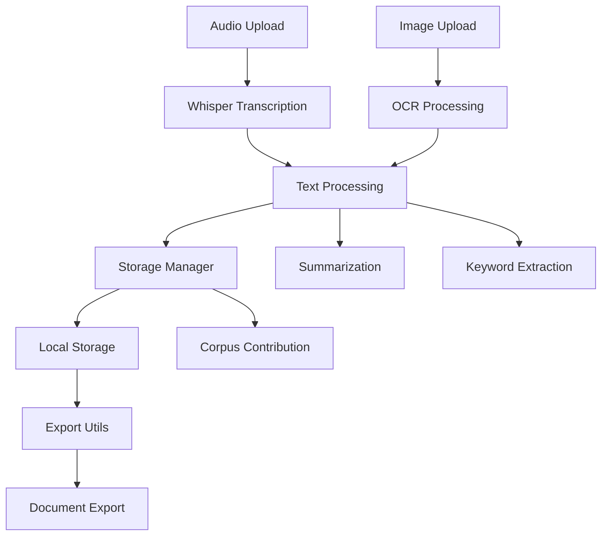

# 🛠️ WhispNote - Tech Stack Documentation

## 📋 Overview

WhispNote is built using a modern, robust tech stack focused on AI/ML capabilities, offline-first functionality, and multilingual support. The application follows a modular architecture with clear separation of concerns.

## 🏗️ Architecture

```
┌─────────────────┐    ┌──────────────────┐    ┌─────────────────┐
│   Frontend UI   │    │   AI/ML Models   │    │  Data Storage   │
│   (Streamlit)   │◄──►│    (Whisper,     │◄──►│   (Local JSON   │
│                 │    │   IndicBART,     │    │   & File System)│
│                 │    │   KeyBERT, OCR)  │    │                 │
└─────────────────┘    └──────────────────┘    └─────────────────┘
```

## 🧩 Core Technologies

### 🎨 **Frontend & UI Framework**
- **[Streamlit](https://streamlit.io/)** `v1.28.0+`
  - **Purpose**: Web-based user interface framework
  - **Why**: Rapid prototyping, Python-native, built-in widgets
  - **Features**: Real-time updates, file uploads, interactive components

### 🤖 **AI/ML Models**

#### Speech-to-Text
- **[OpenAI Whisper](https://github.com/openai/whisper)** `v20231117+`
  - **Purpose**: Multilingual automatic speech recognition
  - **Models**: Supports tiny, base, small, medium, large variants
  - **Languages**: 99+ languages including all major Indian languages
  - **Offline**: Runs completely offline after model download

#### Text Summarization
- **[Transformers (Hugging Face)](https://huggingface.co/transformers/)** `v4.21.0+`
- **[IndicBART](https://huggingface.co/ai4bharat/IndicBART)**
  - **Purpose**: Multilingual text summarization for Indian languages
  - **Coverage**: Hindi, Bengali, Telugu, Tamil, Gujarati, Marathi, etc.
  - **Architecture**: BART-based sequence-to-sequence model

#### Keyword Extraction
- **[KeyBERT](https://maartengr.github.io/KeyBERT/)** `v0.7.0+`
  - **Purpose**: Keyword and key phrase extraction
  - **Method**: BERT embeddings + cosine similarity
  - **Multilingual**: Supports multiple languages via sentence-transformers

#### OCR (Optical Character Recognition)
- **[Tesseract OCR](https://github.com/tesseract-ocr/tesseract)** via `pytesseract` `v0.3.10+`
  - **Purpose**: Primary OCR engine for text extraction
  - **Languages**: 100+ languages including Devanagari scripts
- **[EasyOCR](https://github.com/JaidedAI/EasyOCR)** `v1.7.0+`
  - **Purpose**: Backup OCR with deep learning approach
  - **Strengths**: Better for handwritten and complex layouts

### 💾 **Data Storage & Management**
- **Local File System**
  - **Notes**: JSON files with metadata
  - **Audio**: WAV/MP3 files (temporary storage)
  - **Configuration**: JSON-based settings
- **Directory Structure**:
  ```
  whispnote_data/
  ├── notes/          # Individual note JSON files
  ├── corpus/         # Contributed data (if consented)
  ├── audio/          # Temporary audio files
  └── config.json     # App configuration
  ```

### 🔧 **Supporting Libraries**

#### Audio Processing
- **[librosa](https://librosa.org/)** `v0.9.2+`
  - **Purpose**: Audio analysis and feature extraction
  - **Features**: Format conversion, duration calculation
- **[pydub](https://github.com/jiaaro/pydub)** `v0.25.1+`
  - **Purpose**: Audio manipulation and format conversion
- **[soundfile](https://github.com/bastibe/python-soundfile)** `v0.10.3+`
  - **Purpose**: Audio file I/O operations

#### Document Export
- **[python-docx](https://python-docx.readthedocs.io/)** `v0.8.11+`
  - **Purpose**: Microsoft Word document generation
- **[ReportLab](https://www.reportlab.com/)** `v3.6.0+`
  - **Purpose**: PDF generation and formatting

#### Data Processing
- **[pandas](https://pandas.pydata.org/)** `v1.5.0+`
  - **Purpose**: Data manipulation and analysis
  - **Usage**: Statistics visualization, data export
- **[NumPy](https://numpy.org/)** `v1.21.0+`
  - **Purpose**: Numerical computing foundation

#### Computer Vision
- **[Pillow (PIL)](https://python-pillow.org/)** `v9.0.0+`
  - **Purpose**: Image processing and manipulation
  - **Features**: Format conversion, preprocessing for OCR

## 🌟 **Key Features & Implementation**

### 🔒 Privacy-First Design
- **Local Storage**: All data stored on user's device by default
- **Opt-in Corpus**: Explicit consent required for data contribution
- **Data Anonymization**: Personal identifiers removed before contribution
- **Offline Capability**: Core functionality works without internet

### 🌍 Multilingual Support
```python
SUPPORTED_LANGUAGES = {
    'Hindi': 'hi',      'Telugu': 'te',    'Tamil': 'ta',
    'Bengali': 'bn',    'Marathi': 'mr',   'Gujarati': 'gu',
    'Kannada': 'kn',    'Malayalam': 'ml', 'Punjabi': 'pa',
    'English': 'en'
}
```

### 📱 Responsive Architecture
- **Modular Design**: Separate classes for each AI component
- **Caching**: Streamlit's `@st.cache_resource` for model loading
- **Error Handling**: Graceful degradation with user feedback
- **Scalability**: Easy to add new languages or models

## 📦 **Module Structure**

```
WhispNote/
├── app.py                    # Main Streamlit application
├── whisper_transcriber.py    # Speech-to-text functionality
├── summarizer.py            # Text summarization using IndicBART
├── keyword_extractor.py     # Keyword extraction with KeyBERT
├── ocr_reader.py           # OCR text extraction
├── storage.py              # Data persistence and management
├── export_utils.py         # Document export functionality
├── requirements.txt        # Python dependencies
└── README.md              # Project documentation
```

## 🚀 **Performance Considerations**

### Model Optimization
- **Whisper**: Configurable model sizes (tiny → large) for speed vs accuracy trade-off
- **Caching**: AI models loaded once and cached in memory
- **Lazy Loading**: Models loaded only when needed

### Resource Management
- **Memory**: Efficient cleanup of temporary files
- **Storage**: Compressed JSON for notes, optional audio cleanup
- **CPU**: Background processing with progress indicators

## 🔄 **Data Flow**



## 🛡️ **Security & Privacy**

### Data Protection
- **No Cloud Dependency**: All processing happens locally
- **Temporary Files**: Automatic cleanup of uploaded files
- **User Consent**: Explicit opt-in for any data sharing
- **Anonymization**: Remove personal identifiers before contribution

### Compliance
- **GDPR Ready**: User control over data processing and storage
- **Educational Use**: Designed for research and educational purposes
- **Open Source**: Transparent, auditable codebase

## 🔧 **Development & Deployment**

### Requirements
- **Python**: 3.8+ (recommended 3.9+)
- **RAM**: 4GB+ (8GB+ recommended for large Whisper models)
- **Storage**: 2GB+ for models and data
- **OS**: Cross-platform (Windows, macOS, Linux)

### Quick Start
```bash
# Install dependencies
pip install -r requirements.txt

# Run application
streamlit run app.py
```

### Development Tools (Optional)
```bash
# Code formatting
pip install black flake8

# Testing
pip install pytest

# API development (future)
pip install fastapi uvicorn
```

## 🎯 **Future Enhancements**

### Planned Features
- **Enhanced Recording**: Advanced WebRTC features for improved browser recording
- **Advanced Models**: Integration with newer multilingual models
- **API Layer**: REST API for integration with other applications
- **Mobile App**: React Native or Flutter mobile application
- **Collaborative Features**: Secure sharing and collaboration tools

### Technical Roadmap
- **Performance**: GPU acceleration for faster processing
- **Scalability**: Database integration for larger datasets
- **Analytics**: Advanced corpus analytics and insights
- **Integration**: Plugin system for extensibility

---

## 📞 **Support & Resources**

- **Documentation**: See `README.md` for usage instructions
- **Issues**: Report bugs and feature requests via GitHub
- **Community**: Join discussions about multilingual AI development
- **Contributions**: Welcome contributions to improve Indian language support

---

*WhispNote is built with ❤️ for the multilingual community, promoting inclusive AI development and preserving linguistic diversity through technology.*
